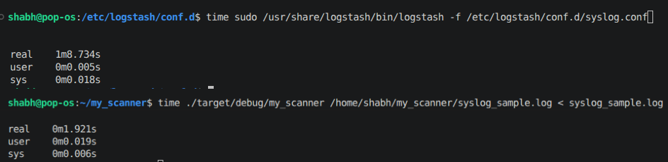
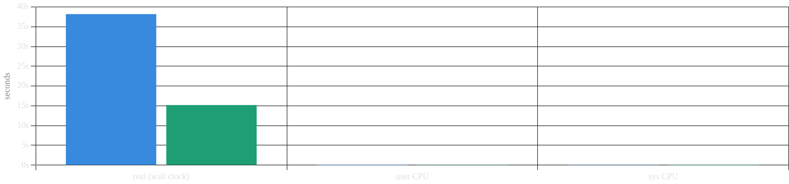
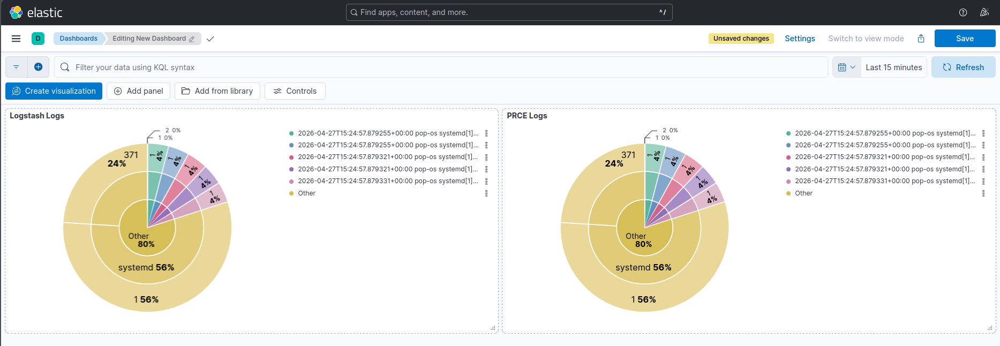

# RustLogger

A Logstash-compatible log parser written in Rust. Auto-detects log types
using the official ELK ECS grok pattern set and indexes structured output
directly into Elasticsearch.

## Why Rust over Logstash

Logstash uses the **Oniguruma** regex engine — a Ruby-era engine bundled
with JRuby. Oniguruma was designed for Unicode correctness, not throughput.
Every grok match goes through its backtracking NFA, which gets expensive
on long patterns with lots of alternation — exactly what syslog patterns
look like. It also carries the full JVM startup cost on every run.

This tool uses **PCRE2** (via Rust's `grok` crate) — a modern engine with
JIT compilation and significantly lower per-match overhead on structured
log patterns. No JVM, no warmup, starts parsing immediately.

## Benchmark — 1000 line syslog file


> Sample test shows higher gap due to logstash's cold start.
> At higher log volumes the gap shortens as JVM overhead fades
> Settles around ~2.5x faster

At large scale logs (>1GB) removing the cold start from both engines the comparison shows :


## How it works

- Loads 308 grok patterns from the official Logstash ECS pattern files
  at startup
- Two-phase priority matching — tries high-signal patterns first,
  short-circuits on first confident match
- Minimum meaningful field threshold — rejects matches that only
  captured wildcard fields (DATA, GREEDYDATA)
- Normalizes timestamps to @timestamp (RFC3339)
- ECS-compatible output fields: host.name, event.original, log.file.path
- Tags failures with _grokparsefailure instead of silent drops
- Indexes directly into Elasticsearch via REST API

## Usage

```bash
ES_PASSWORD=yourpassword ./log-scanner syslog_sample.log
```

## Environment variables

| Variable | Default | Description |
|---|---|---|
| ES_PASSWORD | required | Elasticsearch password |
| ES_URL | https://localhost:9200/logs/_doc | Index endpoint |
| ES_USER | elastic | Username |
| LOGSTASH_PATTERNS | ~/logstash-patterns-core/patterns/ecs-v1 | Pattern dir |

## Requirements

- Rust (cargo)
- Logstash patterns cloned locally:

```bash
git clone https://github.com/logstash-plugins/logstash-patterns-core
```

## Build

```bash
cargo build --release
```
## Output Consistency
Since we are dealing with SIEM, we need to make sure that our logs are consitent with the comparsion (Logstash) since the comparisons are battle tested and proven.
This image shows the pie chart viusal comparisons of both outputs (RustLogger and Logstash) via Kibana.

