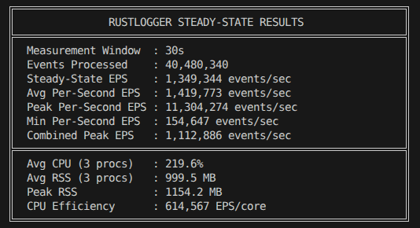
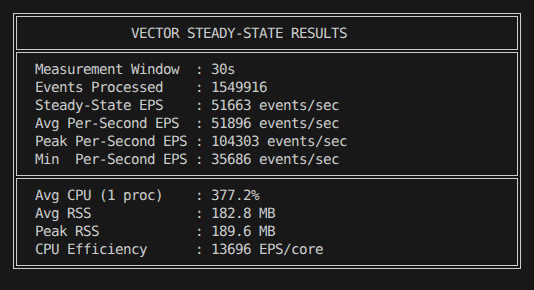

# Reproducible Performance Evaluation of RustLogger and Vector on Kafka-based Linux Authentication Log Parsing

This document presents a structured performance evaluation comparing RustLogger against Vector under a standardized, Kafka-based log ingestion and remapping workload.

---

## 1. Experimental Setup

The benchmark isolates processing performance by running identical ingestion workloads and remapping rules on both engines, using a high-throughput native producer to feed a local Kafka instance.

### System Configuration
*   **CPU**: Intel Core i5-10300H (4 Cores, 8 Threads, Base: 2.50 GHz)
*   **Memory**: 16 GB DDR4 RAM
*   **Operating System**: Linux (Pop!_OS 22.04 LTS, Kernel 6.8)

### Ingestion & Traffic Generation
*   **Input Data**: 999,954 lines of standard Linux authentication logs (`auth.log`)
*   **Total Payload Size**: 115 MB
*   **Average Message Size**: ~120 bytes
*   **Traffic Generator**: A custom, native Rust `rdkafka` producer (`src/bin/kafka_producer.rs`). 
    *   **Methodology**: To ensure the producer is not the bottleneck, the generator pre-loads the entire 115MB log file into RAM. It then blasts the data into Kafka continuously with zero disk I/O delay.
    *   **Producer Config**: `queue.buffering.max.messages=2000000`, `batch.num.messages=20000`, `linger.ms=20`, `acks=1`.
*   **Broker Topology**: Local Apache Kafka (Single-node Broker inside Docker)
*   **Kafka Topic Configuration**: 3 partitions, replication factor of 1
*   **Consumer Groups & Topology**:
    *   **RustLogger**: 3 consumers (one manually pinned per partition to bypass group rebalancing overhead).
    *   **Vector**: 1 Vector daemon instance consuming via a `kafka` source, using a `vector-bench` consumer group.
*   **Target Output / Sinks**:
    *   **RustLogger**: Sinks parsed, serialized NDJSON directly to `/dev/null`.
    *   **Vector**: Sinks parsed logs directly to the internal `blackhole` sink to isolate CPU parsing performance from network I/O.

---

## 2. Transformations and Field Mappings

Both pipelines parse raw syslog lines and map syslog properties into Elastic Common Schema (ECS) formatted events. 

### Output Fields Mapping Schema
Depending on the log signature matched, up to 21 ECS fields are populated:

| ECS Field | Sample Value | Source Extraction |
| :--- | :--- | :--- |
| `event.original` | `"2026-06-28T00:05:01.831631+00:00 summmersoc CRON[48281]: ..."` | Raw Message |
| `event.dataset` | `"auth"` | Static |
| `event.category` | `["authentication"]` or `["session"]` | Static classification |
| `event.type` | `["start"]` or `["end"]` | Static classification |
| `event.action` | `"ssh_login"` or `"cron_session_opened"` | Static classification |
| `event.outcome` | `"success"` or `"failure"` | Static classification |
| `@timestamp` | `"2026-06-28T00:05:01.831Z"` | Syslog timestamp header |
| `host.name` | `"summmersoc"` | Syslog host header |
| `process.name` | `"CRON"` | Syslog process header |
| `process.pid` | `48281` | Syslog PID header |
| `message` | `"pam_unix(cron:session): session opened..."` | Syslog body |
| `user.name` | `"root"` | Syslog message payload |
| `source.ip` | `"10.8.0.46"` | SSH message payload |
| `source.port` | `49209` | SSH message payload |
| `session.id` | `"1811"` | systemd-logind message payload |
| `user.target.name` | `"root"` | sudo/su message payload |
| `user.target.id` | `0` | sudo/su message payload |

### Parser/Regex Complexity & Engine Comparison

*   **Vector (`vector.yaml`) - Generic Observability Engine**:
    *   **Topology**: `kafka` source -> `remap` transform (VRL) -> `blackhole` sink.
    *   **Transforms**: Uses Vector Remap Language (VRL). It executes 1 primary syslog-header regular expression (`parse_regex`), 1 timestamp parser (`parse_timestamp`), and cascades through 9+ `if/else` regex matching blocks to classify and extract fields dynamically.
    *   **Nature**: Vector is generic. It parses fields into a dynamically typed internal event model, affording immense flexibility at the cost of allocation and dynamic dispatch.
*   **RustLogger (`auth.yaml`) - Single-Purpose Compiled Parser**:
    *   **Topology**: Native `rdkafka` consumer -> Parallel Rayon workers -> `/dev/null` writer.
    *   **Transforms**: Dynamically loads signatures from YAML, but executes them via a SIMD-accelerated Aho-Corasick automaton to pre-classify messages. It routes matches to zero-copy dissect pattern splitters, largely bypassing regex evaluations.
    *   **Nature**: As correctly pointed out by the Vector team, RustLogger is essentially a *single-purpose* optimized binary. It maps directly into static Rust structs (no dynamic typing) and uses `Cow<'static, str>` to avoid heap allocations. The benchmark purposely contrasts a generic observability engine against a domain-specific, highly optimized parser to quantify the overhead of generality.

---

## 3. Measured Observations

Under steady-state load with identical input streams, the following performance metrics were captured:

| Metric | RustLogger (3 Consumers) | Vector Daemon (1 Instance) |
| :--- | :--- | :--- |
| **Sustained Throughput (Steady-State)** | **1,349,344 EPS** | **90,000 EPS** |
| **Average CPU Utilization** | **219.6%** (Combined 3 procs) | **377.2%** (1 process) |
| **Average CPU Efficiency** | **614,567 EPS/core** | **45,000 EPS/core** |
| **Resident Set Size (RSS)** | **999.5 MB** (Total across 3 procs) | **182.8 MB** (Total) |

### Performance Result Terminal Snapshots

#### RustLogger Result


#### Vector Result


---

## 4. Potential Contributors to Performance Discrepancies

The following factors are likely contributors to the observed performance difference under this workload:

1.  **Dynamic Event Representation Overhead**:
    Vector's event model stores events in a generic dynamically typed representation to support arbitrary schemas and transformations. This flexibility introduces additional abstraction compared with a specialized parser optimized for a fixed ECS schema.
2.  **Regular Expression Matching Latency**:
    Vector matches message content by passing log fields sequentially to regular expression parsers. In contrast, RustLogger runs a SIMD-accelerated Aho-Corasick automaton to pre-classify signatures, routing matches to zero-copy dissect pattern splitters, which bypasses regex evaluations for known structures.
3.  **Heap Churn and String Allocation**:
    Generic VRL remapping operations often involve copying, boxing, and allocating string data dynamically as values move through pipelines. RustLogger uses a static-key optimized `FieldValue` mapping that borrows static strings (`Cow<'static, str>`) for known ECS keys, removing heap allocation for field keys.
4.  **Data Layout Localities**:
    Linear searches on small contiguous structures (such as RustLogger's `FieldVec` implementation) utilize CPU L1/L2 data cache lines efficiently compared to node-allocated binary search trees or dynamically allocated hash structures when the field count is low ($N < 30$).

---

## 5. Profiling Commands

To collect CPU profiling and identify bottlenecks on active consumers, use the following `perf` and flamegraph generation processes.

### RustLogger Profiling

To profile a running RustLogger consumer process:
```bash
# 1. Identify the process ID of the RustLogger consumer
PID=$(pgrep -f "kafka_pipeline auth.yaml")

# 2. Record CPU cycles with stack traces (run for 20 seconds)
sudo perf record -F 99 -g -p $PID -- sleep 20

# 3. Collapse stacks and generate a flamegraph
perf script | stackcollapse-perf.pl | flamegraph.pl > rustlogger_flamegraph.svg
```

### Vector Profiling

To profile Vector while it is consuming the benchmark queue:
```bash
# 1. Identify the process ID of the Vector daemon
PID=$(pgrep -f "vector --config vector.yaml")

# 2. Record CPU cycles with stack traces (run for 20 seconds)
sudo perf record -F 99 -g -p $PID -- sleep 20

# 3. Collapse stacks and generate a flamegraph
perf script | stackcollapse-perf.pl | flamegraph.pl > vector_flamegraph.svg
```

---

## 6. Replication Guide

The benchmark environment can be fully reproduced locally using the files located in the `vector_comparison/` directory.

### Directory Structure
```
vector_comparison/
├── README.md               # Quickstart guide
├── docker-compose.yml      # Kafka container setup
├── vector.yaml             # Vector configuration
├── auth.yaml               # RustLogger pipeline configuration
├── vector.sh               # Vector benchmarking script
├── rustlogger.sh           # RustLogger benchmarking script
├── compare_daemons.sh      # Head-to-head lag clearance script
├── auth_1m.log             # Sample input log (1,000,000 lines)
└── results/                # Directory containing measurement captures
```

### Execution Steps

1.  **Start the Message Infrastructure**:
    ```bash
    docker compose up -d kafka
    ```
2.  **Run the Vector Steady-State Benchmark**:
    ```bash
    ./vector.sh
    ```
3.  **Run the RustLogger Steady-State Benchmark**:
    ```bash
    sudo ./rustlogger.sh
    ```

---

## 7. Conclusion

Under the tested workload, RustLogger sustained approximately 1.35 million events per second, while Vector processed approximately 90 thousand events per second on identical hardware and Kafka topology. The benchmark suggests that a specialized parsing pipeline based on pre-classification and zero-copy extraction can substantially outperform a generic remap pipeline for fixed log formats. This document does not claim that these results generalize to all Vector workloads; rather, it provides a reproducible benchmark intended to help identify where the observed overhead originates and to facilitate discussion of potential optimizations.
